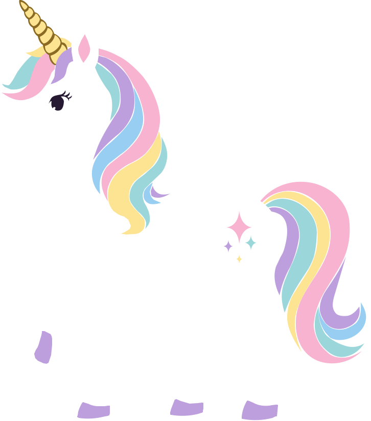

# Over the Rainbow
> *The quest for the magical mountain!*

You gathered 80 unicorns, but 3 of them got lost on the way. 

Unicorns must unite in an effort to locate a mystical place called Candy Mountain. To reach it they must order themselves, in ascending order of age, in this 6 by 6 grid of rainbow and a start and finish area.

### This game was created for the [2026 js13kGames](https://js13kgames.com/) where the theme was `Unicorns and Rainbows`.

This is a drag & drop game. Drag cards to the board, or drag them to the discard pile. 

⚠️ You must discard cards when placing next to another to a maximum of 4 cards

During the 'Start' card play phase, you must discard 8 cards from your hand.

## FUTURE ME PROBLEMS

- add difficulty levels by creating buttons and removing more cards
- add new map layouts
- add automatic draw when dicarding 2 cards!
- add animations & sounds for cards being drawn

### Setup
Run `npm install` in a terminal

### Development
Run `npm run start` to start the game on a development server on `localhost:8080`.

### Production
Use `npm run build` to create a minified file and zip it with the `index.html`. The result will be available in the `build` directory.